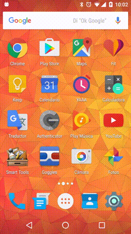

# Capstone-Project

**Udacity Android nDegree - Capstone Project (final project)**  
This project is part of the Udacity Android online Nano-Degree co-created by Google.

# YAAA (Yet Another Alarm App)

**Download it on [Google Play](https://play.google.com/store/apps/details?id=com.nulleye.yaaa)**

## Capstone, Stage 1 - Design
Design the app, build the app project plan.

## Capstone, Stage 2 - Build
Build the app, execute the project plan lo.

**Project changes**

Due to time restrictions, surely the project was too ambitious for a one month project combined with my full time job (I almost have no life this month), I've been forced to cut down a bit the initially planned functionality. Also, creating an alarm app is not an easy task either.

By the way, this also allows me to be able to create a future **Pro** (paid) version.

What has been cut:

* **Tablet specific** layout: this app is more useful and interesting, and will be mostly used by for phone users, so "If you want it in a tablet, buy it" doesn't seems crazy.

* **Multiple alarm screens** (alarm dismiss modes): I want to provide good quality, API 16 compatible and interactive animations, and this will require much more research and development. Pay for these modes, like **Shake to Snooze - Random button to Stop** or **Problem solving to Stop** seems quite fair.

* **Streaming sound sources**: for the same reason, integrate Spotify, Radio stations or Google Music is not an easy task, mainly on the user verification / login, and the artist, album and song browsing. Also this is a very good plus for a paid app.

The rest is what it was planned, and in some things is even better. ;)

If someone wants to contribute to this project, or help me in the Pro version, please, feel free to contact me at any time!! 
